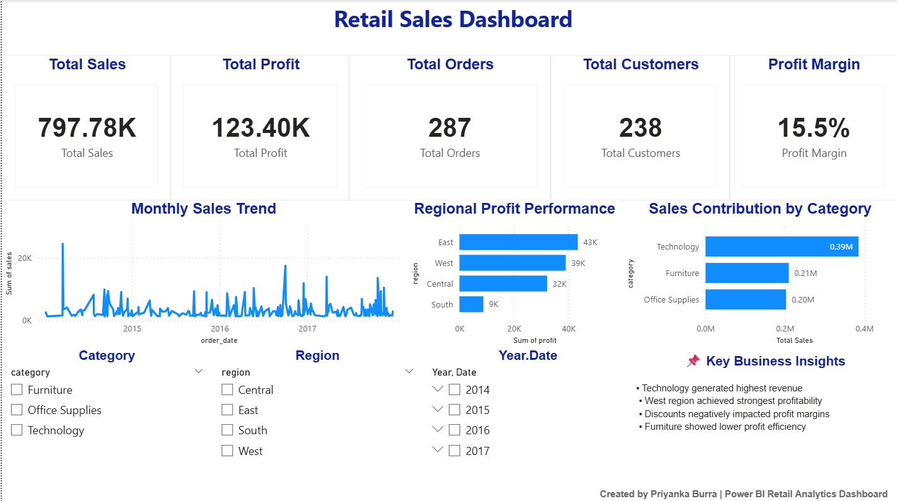

# Retail Sales & Customer Behavior Analysis

Business Intelligence and Data Analytics project focused on analyzing retail sales performance, customer purchasing behavior, profitability trends, and operational KPIs using Python, SQL, and Power BI.

This project demonstrates an end-to-end analytics workflow including data preprocessing, exploratory data analysis (EDA), SQL-based business analysis, KPI reporting, and interactive dashboard development.

---

## Dashboard Preview



---

## Project Overview

This project transforms raw retail transaction data into actionable business insights for strategic decision-making and performance monitoring.

Key analysis areas include:

* Sales and profit performance
* Regional business analysis
* Customer purchasing behavior
* Product category contribution
* KPI reporting and profitability analysis

---

## Business Objectives

* Analyze sales and profitability trends
* Identify top-performing product categories
* Compare regional business performance
* Evaluate discount impact on profitability
* Develop an interactive business intelligence dashboard

---

## Technology Stack

| Tool             | Purpose                             |
| ---------------- | ----------------------------------- |
| Python           | Data preprocessing and analysis     |
| Pandas           | Data cleaning and transformation    |
| NumPy            | Numerical operations                |
| SQL              | Business querying and KPI analysis  |
| Power BI         | Dashboard development and reporting |
| Jupyter Notebook | Exploratory Data Analysis           |

---

## Analytics Workflow

### Data Cleaning & Preprocessing

* Removed null values
* Eliminated duplicate records
* Standardized column names
* Corrected inconsistent data types

### Exploratory Data Analysis (EDA)

* Monthly sales trend analysis
* Regional profitability analysis
* Customer purchasing behavior insights
* Category contribution analysis

### SQL-Based Analysis

* KPI calculations
* Revenue analysis
* Profitability reporting
* Aggregation analysis
* Customer-level insights

### Dashboard Development

Developed an interactive Power BI dashboard featuring:

* KPI cards
* Dynamic filters
* Trend analysis
* Regional comparisons
* Business insights visualization

---

## Key Business Insights

* Technology category generated the highest revenue contribution
* West region achieved the strongest profitability performance
* Discounts negatively impacted overall profit margins
* Furniture category showed comparatively lower profit efficiency

---

## Skills Demonstrated

### Data Analytics

* Exploratory Data Analysis (EDA)
* KPI Reporting
* Business Intelligence
* Data Cleaning & Transformation

### Technical Skills

* Python
* SQL
* Power BI
* Data Visualization
* Dashboard Development

---

## Repository Structure

```bash
retail-sales-customer-behavior-analysis/
│
├── data/
├── notebooks/
├── sql/
├── README.md
├── requirements.txt
├── LICENSE
├── Retail_Sales_Dashboard.pbix
├── Retail_Sales_Dashboard.pbix.png
└── .gitignore
```

---

## How to Run

```bash
git clone https://github.com/Priyanka-Burra/retail-sales-customer-behavior-analysis.git
```

```bash
pip install -r requirements.txt
```

```bash
jupyter notebook
```

---

## Future Improvements

* Predictive sales forecasting
* Customer segmentation analysis
* Advanced DAX measures
* Automated ETL pipelines

---

## Author

### Priyanka Burra

Aspiring Data Analyst skilled in:

* SQL
* Python
* Power BI
* Business Intelligence
* Data Visualization

---

## License

This project is licensed under the MIT License.
